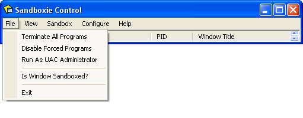
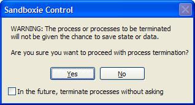
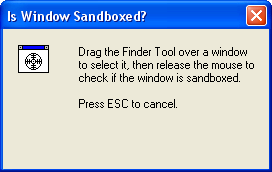

# File Menu

[Sandboxie Control](SandboxieControl.md) > File Menu

* * *

### Terminate All Programs

[Sandboxie Control](SandboxieControl.md) > [File Menu](FileMenu.md) > Terminate All Programs

The _Terminate All Programs_ command immediately stops all programs running in all sandboxes. There is no window associated with this command. However, you may be warned about the potential loss of any data processed by the programs which are about to be terminated:

This warning refers to, for example, any open documents which will not be saved. This warning can be disabled by selecting the checkbox at the bottom: _In the future, terminate processes without asking._

See also: [Terminate All Programs](TrayIconMenu.md#terminate-all-programs) in [Tray Icon Menu](TrayIconMenu.md).

* * *

### Disable Forced Programs

[Sandboxie Control](SandboxieControl.md) > [File Menu](FileMenu.md) > Disable Forced Programs

The _Disable Forced Programs_ toggle command temporarily disables or re-enables forced sandboxing. Normally, any [forced programs](ProgramStartSettings.md#forced-programs) (or programs in any [forced folders](ProgramStartSettings.md#forced-folders)) will automatically start under the supervision of Sandboxie. Forced sandboxing is temporarily suspended when the Disable Forced Programs command is invoked.

By default, forced sandboxing is suspended for 10 seconds. The number of seconds can be changed in the following dialog box, which appears when you select this command.

Note that the associated command in the [Tray Icon Menu](TrayIconMenu.md) does not show this dialog box, and uses the last duration specified, or the default of 10 seconds.

For the duration that the Disable Forced Programs mode is in effect:

*   The Sandboxie icon in the system tray area includes a small red X.
*   The "Disable Forced Programs" command in the [File Menu](FileMenu.md) and [Tray Icon Menu](TrayIconMenu.md) appears with a checkmark next to it.
*   Message [SBIE1301](SBIE1301.md) will be issued if any forced programs are started.
*   Selecting this command again will cancel the mode, restore the icon to its original appearance, and resume the normal operation of forced sandboxing.

See also: [Disable Forced Programs](TrayIconMenu.md#disable-forced-programs) in [Tray Icon Menu](TrayIconMenu.md).

* * *

### Run As UAC Administrator

[Sandboxie Control](SandboxieControl.md) > [File Menu](FileMenu.md) > Run As UAC Administrator

The _Run As UAC Administrator_ toggle command tells Sandboxie to ask for elevation to Administrative privileges before starting any programs. This command is only available on Windows when User Account Control (UAC) is in effect, and the user account is not already elevated. If this command is available in the menu, then it is typically necessary to enable it before installing programs into the sandbox, and it is recommended to disable it when that installation is complete.

There is no window associated with this command. However, while the _Run As UAC Administrator_ is in effect, the command appears in the [File Menu](FileMenu.md) and [Tray Icon Menu](TrayIconMenu.md) with a checkmark next to it.

See also: [Run As UAC Administrator](TrayIconMenu.md#run-as-uac-administrator) in [Tray Icon Menu](TrayIconMenu.md).

* * *

### Is Window Sandboxed?

[Sandboxie Control](SandboxieControl.md) > [File Menu](FileMenu.md) > Is Window Sandboxed?

The _Is Window Sandboxed?_ command is used to select a window displayed on the screen, and if the window is owned by a sandboxed program, the command displays the name of the program and the sandbox it is running in.

To use the command, click and hold the left mouse button on the _Finder Tool_, that is, the icon of a target within a window. Without releasing the left mouse button, drag the target over the desired window, and when the target is within the boundaries of the desired window, release the left mouse button.

If the window is owned by a sandboxed program, Sandboxie will display the program name and sandbox name, will switch the view to [Programs View](ProgramsView.md), and highlight that program.

Some programs display their windows using customized graphics, and this prevents Sandboxie from showing the [#] indicators in the title bar. In these cases, you can use the _Is Window Sandboxed?_ command to make sure that the window and its related program are running sandboxed.

* * *

### Exit

[Sandboxie Control](SandboxieControl.md) > [File Menu](FileMenu.md) > Exit

The _Exit_ command quits [Sandboxie Control](SandboxieControl.md). Note that merely closing the window (or selecting the _Hide Window_ command from the [Tray Icon Menu](TrayIconMenu.md)) _does not_ quit Sandboxie Control.

Sandboxie is still active and correctly supervise programs even when the front-end application, Sandboxie Control, is inactive. However, the following features are provided by the Sandboxie Control and will not be available when the front-end program is not running:

*   Automatic Delete Sandbox
*   Quick and Immediate Recovery
*   Disable Forced Programs mode (when initiated from the [Sandboxie Start](StartCommandLine.md) program)

If you do not wish to see Sandboxie Control in your system tray area, consider configuring the Windows task bar to always hide the icon, rather than exit Sandboxie Control.

* * *

Go to [Sandboxie Control](SandboxieControl.md#menus), [Tray Icon Menu](TrayIconMenu.md), [Help Topics](HelpTopics.md).
