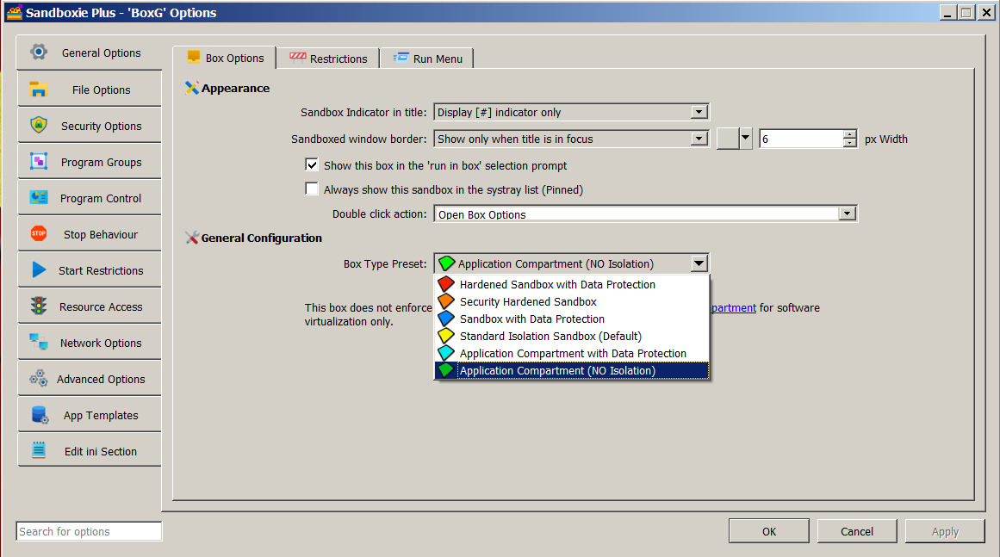

# Compartment Mode

**NOTE: This feature requires a [supporter certificate](https://sandboxie-plus.com/supporter-certificate/).**

The concept of an "Application Compartment" mode was introduced in **Sandboxie Plus v1.0.0**. This mode disables the normally used token-based security isolation in order to significantly improve compatibility while still retaining a level of security comparable to that of other available sandboxing products. It avoids many of the typical Sandboxie issues caused by processes running with a heavily restricted token.

The setting for a compartment box can be enabled by adding `NoSecurityIsolation=y` to the box settings section of **Sandboxie.ini**. It can also be enabled in the Sandman UI. Right-click on a box and select "Sandbox Options" from the drop-down menu (or simply double-click on a box) to bring up the Box Options UI. Select the Box Type Preset as "Application Compartment (NO Isolation)" (with a **green** box icon) and click OK to apply changes. The status column of Sandman UI labels this box as **Application Compartment**.

In compartment mode, file system and registry filtering are still in place to enforce any access rules. So, processes do run without administrative privileges. This filtering can be disabled by adding `NoSecurityFiltering=y` to the box settings section of **Sandboxie.ini** in order to provide a greater degree of compatibility.

A new object access filter, enabled by default for new installations since **Sandboxie Plus v1.0.16**, replaces the Sandboxie's old process/thread handle filter to facilitate process isolation. For previous versions starting with **Sandboxie Plus v1.0.0**, it can be enabled by adding `EnableObjectFiltering=y` to the [GlobalSettings] section of **Sandboxie.ini**.

**Caveat:** Even though an application compartment virtualizes the file system and registry, it does not change the process token or apply other more limiting restrictions. As a result, a process could potentially escape the virtualization. Because of this reduced security (even though it is only a slight reduction), this mode should be **avoided for untrusted applications**.

**Recent Changes:** Token based workarounds were added in subsequent Sandboxie Plus versions to facilitate even greater compatibility with the more commonly used programs. They used `DropAppContainerToken=y` for such workarounds and `FakeAppContainerToken=program.exe,n` to disable their use for a specific program. In **Sandboxie Plus v1.8.2a** and above, such workarounds are disabled when in compartment mode. In case of issues with some programs (primarily browsers), they can be re-enabled by using `DeprecatedTokenHacks=y`. **Sandboxie Plus v1.8.0** moved the built-in access rules for an application compartment box to a dedicated template (included in the file **Templates.ini** under the `[TemplateAppCPaths]` section) for easier management. **Sandboxie Plus v1.10.1** addressed and fixed various long-standing bugs affecting application compartment boxes.

**Fun Fact (for any box type):** If you add `OpenFilePath=*` to the box settings section of **Sandboxie.ini** (or disable the isolation in some other way), the status column in the Sandman UI displays **OPEN Root Access** as a warning that this box is no longer really a "sandbox"! Starting with **Sandboxie Plus v1.3.2**, the box icon also changes its default color.

